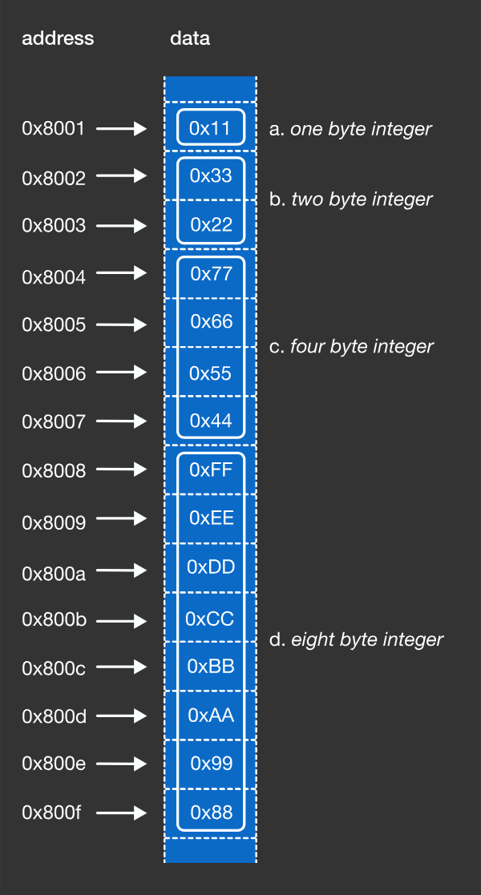

# Data Types

## What are Data Types?
At the end of the day, all a computer understands is `0` and ones `1`.
A computer may see several sequence's of `0` or `1s` like the following:

```c
1010101010 
1010101010 1010101010
1010101010 1010101010 1010101010
1010101010 1010101010 10101010101 010101010
```

but how can we tell our computer to interpret a certain sequence of binary numbers as a integer or letter... etc?

We use types in our programming language! Types are a programming language construct that
specifies both the size and an interpretation of a series of bits stored in a computer.

```c
#include <stdio.h>
int main () {
  // Different data types in the C programming language.
  char a = 0x11;
  short b = 0x2233;
  int c = 0x44556677;
  long d = 0x8899AABBCCDDEEFF;
  return 0;
}
```



