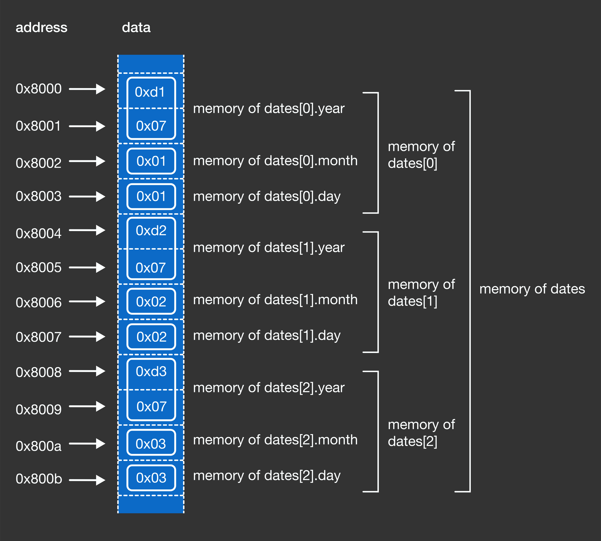

# Arrays

### What are Arrays?
A variable that can hold more than one value of the same type.

Below we are allocating space for 3 integers. We have only told our program
at this point to allocate space for 3 integers, but those individual memory addresses
will still have whatever value were stored there.

```c
#include <stdio.h>
int main () {
  int grades[3];

  for (int i=0; i<3; i++) {
    printf("grades[%d]=%d\n", i, grades[i]);
  }
  return 0;
}
```

It's only until we do our assignment that those original slots get overwritten:

```c
#include <stdio.h>
int main () {
  int grades[3];      // [0, 1 , 2]
  grades[0] = 0;
  grades[1] = 1;
  grades[2] = 2;

  for (int i=0; i<3; i++) {
    printf("grades[%d]=%d\n", i, grades[i]);
  }

  return 0;
}
```


### Array Indexing and How it Works
Note, in C you declare the size of your array up front and once you do it's fixed.
There other data structures that allow for dynamic array's when we need the and `malloc` but that's another topic.

Let's break down what happens when we run this program:

```c
#include <stdio.h>
int main () {
  int grades[3];
  grades[0] = 0;
  grades[1] = 1;
  grades[2] = 2;
  return 0;
}
```

1. 
We allocated a continguous block of memory big enough to store 3 integers.
An integer data type uses 4bytes (32bits).
3 * 4 = 12bytes of memory will be set aside for our use.

2.
The variable name `grades` is assigned to the block of memory.
More specifically, the variable `grades` is assigned a pointer to the address in memory pointing to the 1st element of the array.

3.
When we index a the grades array like so `grades[0]`, C will look at `grades` location in memory (AKA the first element of `grades`)
and uses that index number inside the bracket as the number of steps in the memory block to jump to.
So if we access:
- `grades[2]` C will jump 8 bytes (2 steps x 4 bytes, which is the size of an integer data type)
- `grades[500]` it will jump 2000 bytes (500 steps x 4 bytes) past the beginning of the memory block


### Memory Layout of an Array of Structs

```c
#include <stdio.h>
int main () {
  struct date_t {
    short year;
    char month;
    char day;
  };

  struct date_t dates[3];

  dates[0].year = 2001;
  dates[0].month = 1;
  dates[0].day = 10;

  dates[1].year = 2002;
  dates[1].month = 2;
  dates[1].day = 20;

  dates[2].year = 2003;
  dates[2].month = 3;  // this member
  dates[2].day = 30;
}
```




### References
- https://brilliant.org/practice/memory-layout/?p=9