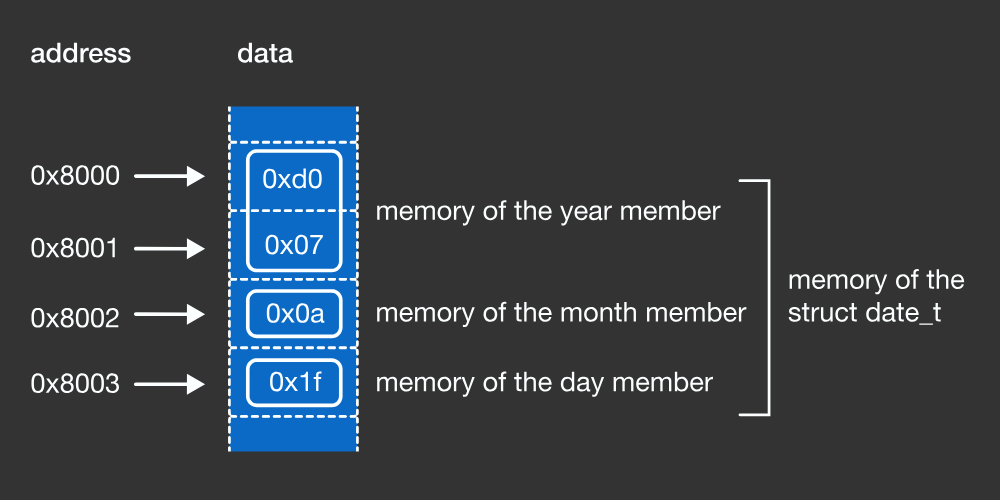

# Structs

## What is a Struct?
A struct (AKA structure) is a data type that allows you to bundle multiple variables into a single entity.
If your coming from other languages, the `structs` concept is similar to objects in other languages.

```c
#include <stdio.h>
int main () {
  struct date_t {
    short year = 2000;
    char month = 10;
    char day = 20;
  };
}
```




### Example 0:
```c
#include <stdio.h>
int main () {
  struct Point3D {
    int x;
    int y;
    int z;
  };
  
  // Dot notation assignments
  struct Point3D p1;
  p1.x = 0;
  p1.y = 0;
  p1.z = 0;

  // Struct notation assignment
  struct Point3D p2 = {.x=1, .y=2, .z=3};

  printf("p1 = (%d,%d,%d) and p2 = (%d,%d,%d)\n", p1.x, p1.y, p1.z, p2.x, p2.y, p2.z);
  return 0;
}
```

### Example: Using typedef to shorten structure declarations
Here we no longer need to use the `struct` keyword because we used `typdef` in our original struct declaration

```c
#include <stdio.h>
int main () {

typedef struct {
    int x;
    int y;
    int z;
  }  Point3D;
  
  // Dot notation assignments
  Point3D p1;
  p1.x = 0;
  p1.y = 0;
  p1.z = 0;

  // Struct notation assignments
  Point3D p2 = {.x=1, .y=2, .z=3};

  printf("p1 = (%d,%d,%d) and p2 = (%d,%d,%d)\n", p1.x, p1.y, p1.z, p2.x, p2.y, p2.z);
  return 0;
}
```


### Example: Array of Structs
```c
#include <stdio.h>

int main () {
  typedef struct {
    int x;
    int y;
    int z;
  }  Point3D;
  
  Point3D myPoints[10]; // Creating an array
  for (int i=0; i<10; i++) {
    myPoints[i].x = i;
    myPoints[i].y = i;
    myPoints[i].z = i;
  }
  return 0;
}
```


### Details
<!-- This phrasing is contextual to the course ........extract this convention stuff to a single document.... -->
You may be starting to notice that the definitions of many data types are essentially a set of agreed upon conventions.
One of the great things about rich programming languages like C is that they give a programmer the power to create new
data types and associated conventions. Some conventions, like the IEEE floating point standard, are agreed upon across
multiple programming languages, compilers, machine languages, and the architecture of the processors they run on.
This requires the coordination of hundreds of companies and tens of thousands of engineers. 

Other conventions can be more local, existing only in a particular code base, or a collection of files that all use a common library.
This may require the coordination of multiple people (who are usually working together already) or may only affect a single person
who simply wishes to produce clean, modifiable, and debuggable programs.

Suppose you are designing a program that regularly draws and computes various properties of rectangles.
It would be very convenient to have a data type that captures the basic properties of a rectangle. In C,
this is accomplished via the keyword `struct`

<image src="../../../../images/struct-conceptual-image.png">


### Memory Layout of Struct
- https://brilliant.org/practice/memory-layout/?p=7