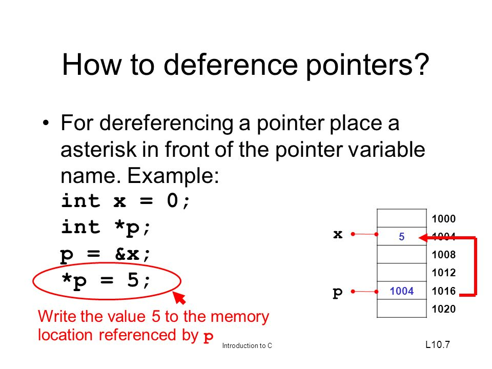

# Pointer dereferencing

## What is pointer dereferencing?
Accessing or manipulating data at a memort location pointed by a pointer.


```c
#include <stdio.h>
int main (int argc, char *argv[]){
  int x = 0;
  int *p;
  p = &x;

  *p = 5;
  printf("x=%d\n", x); 
  
  return 0;
}
```

