# Pointers to Function
One of the handy things you can do in C, is to use a pointer to point to a function. This is particularly useful for passing function's around to other functions, passing big data structures into functions (so we don't need to make a copy IF we don't want to.)

```c
#include <stdio.h>

int add( int a, int b ) {
  return a + b;
}

int subtract( int a, int b ) {
  return a - b;
}

int multiply( int a, int b ) {
  return a * b;
}

void doMath( int (*fn)(int a, int b), int a, int b ) {
  int result = fn(a, b);
  printf("result = %d\n", result);
}

int main(void) {
  int a = 2;
  int b = 3;

  doMath(add, a, b);
  doMath(subtract, a, b);
  doMath(multiply, a, b);

  return 0;
}
```

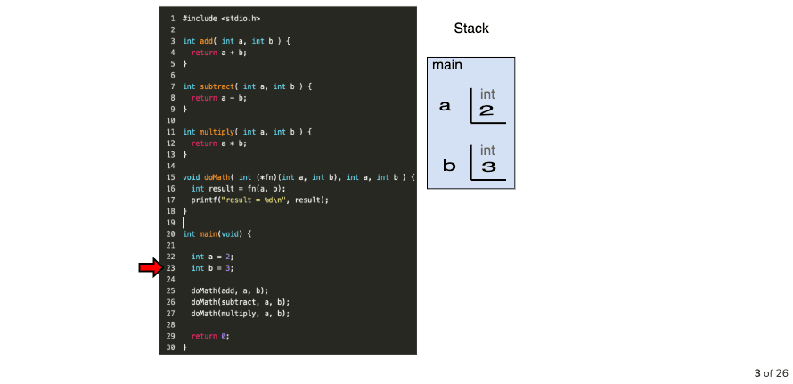
We are inside `main()` and the variables `a` and `b` get created and thereby added to the stack for the current function context.

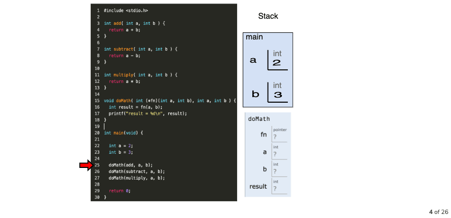

We call `doMath` and pass the `add` function.
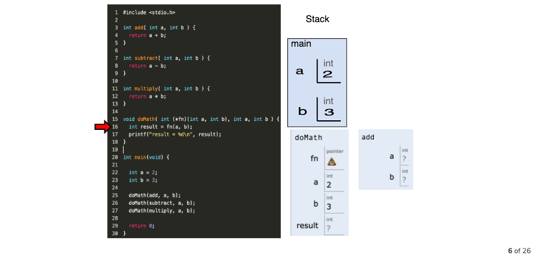
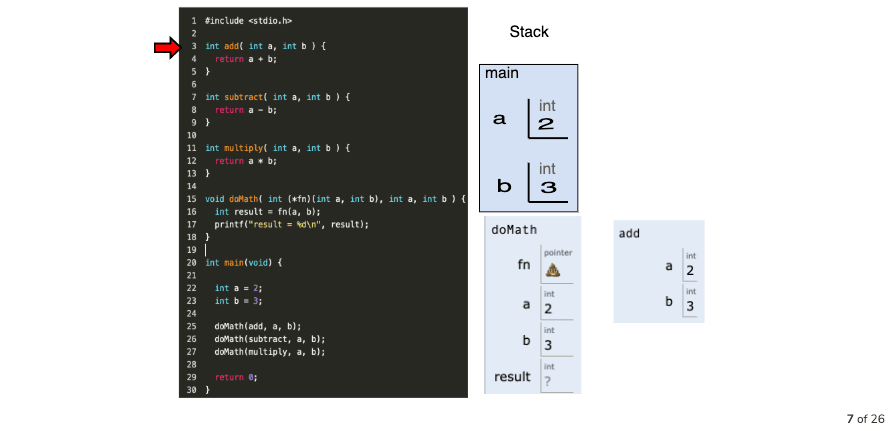

When we step into `doMath`, whatever function we passed, we grab a reference to it's memory address, in this case on line 16, we now are calling `add(a,b)`.

```
int(*fn) (int a, int b)
```
means we want a pointer to a specific kind of function, one that returns an int and takes in two ints as arguments.

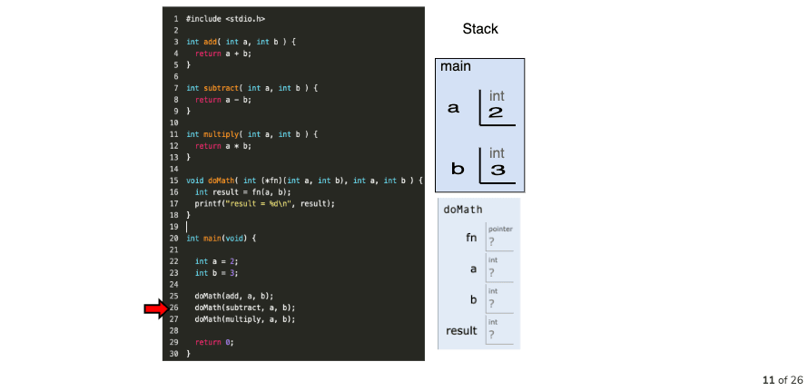
We call the next `doMath` call with `subtract`.
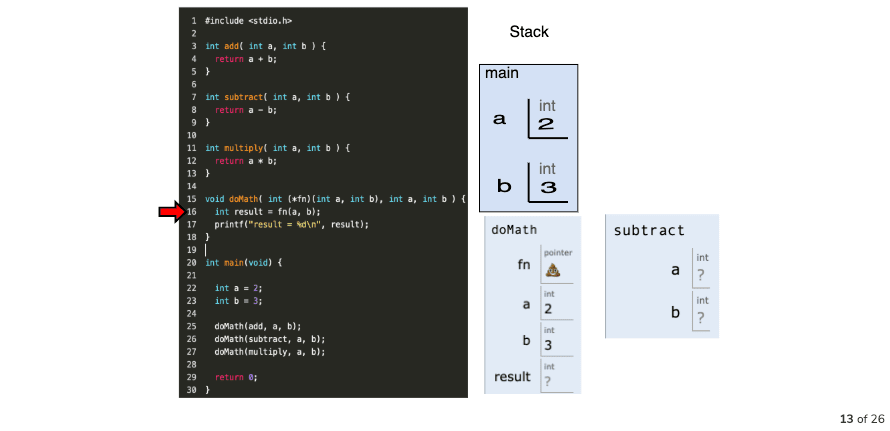
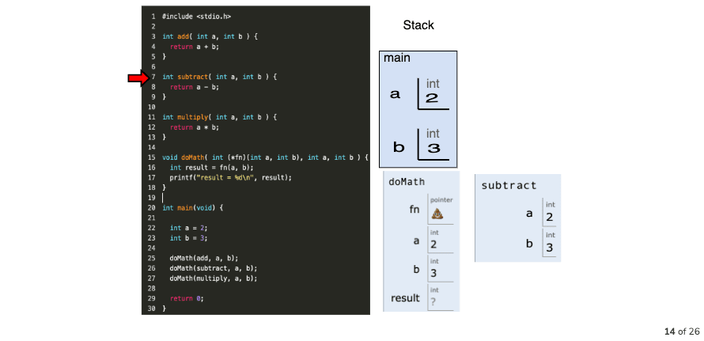
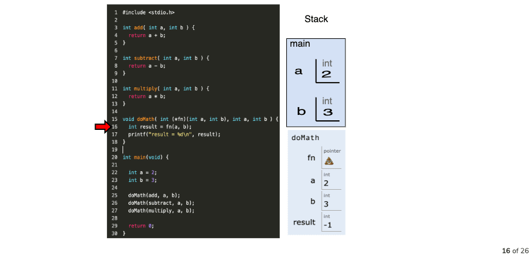
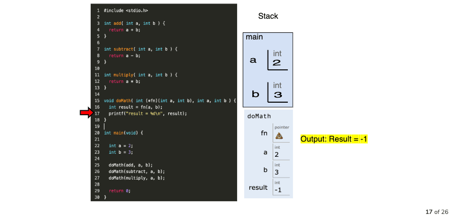

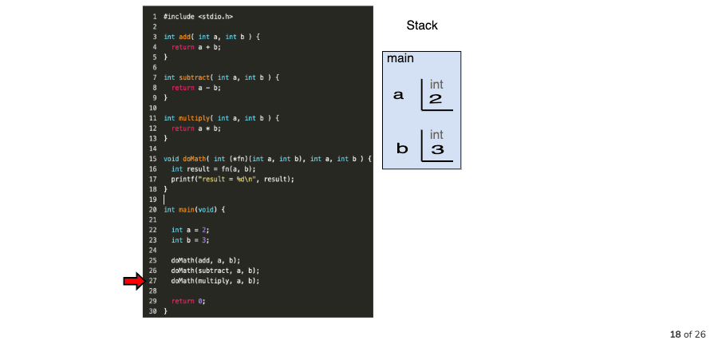
We call the next `doMath` call with `multiply` 

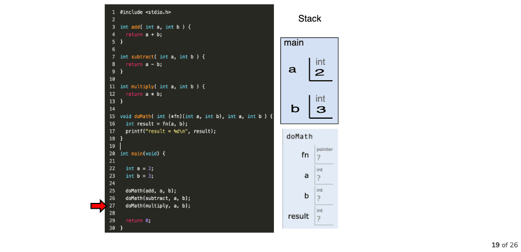

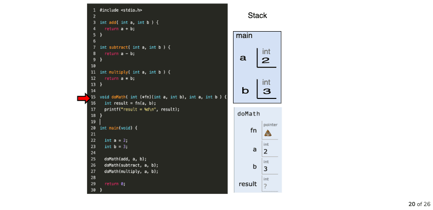


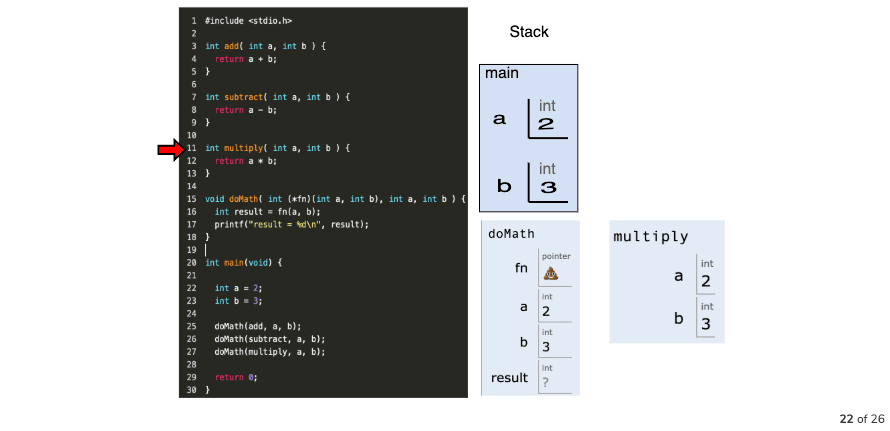

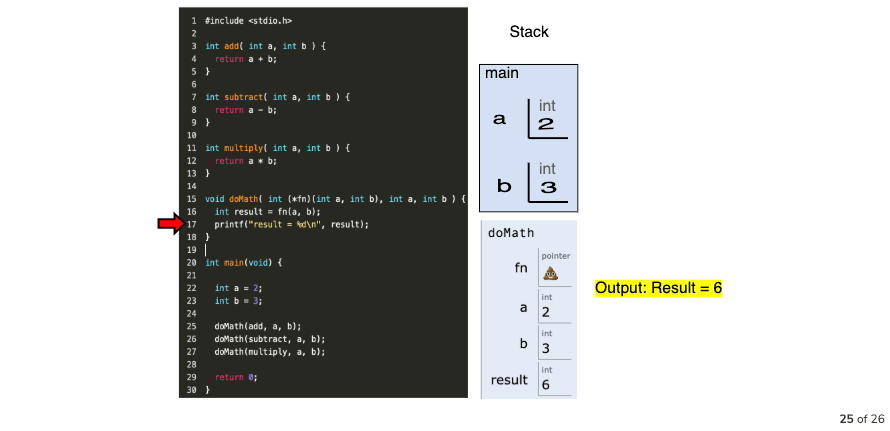

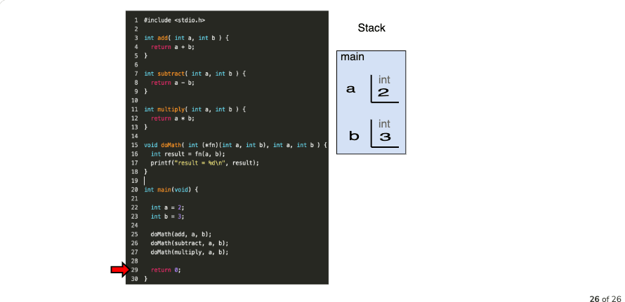
