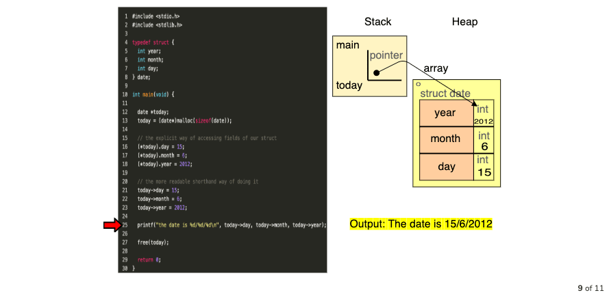
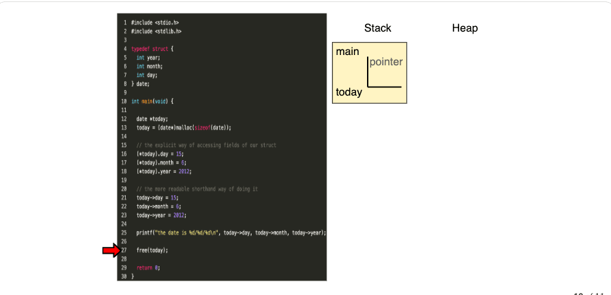

# Pointers to Structs
Pointers can also be used to point to a struct. There are a couple of ways of handling structs using pointers:
- (*pointer).attribute OR pointer->attribute 

```c
#include <stdio.h>
#include <stdlib.h>

typedef struct {
  int year;
  int month;
  int day;
} date;

int main(void) {
  date *today;                           // creating pointer variable `today` to be a pointer to `date`
  today = (date*)malloc(sizeof(date));   // allocating a block of memory on the heap big enough to store one `date` struct.

  // the explicit way of accessing fields of our struct
  (*today).day = 1;
  (*today).month = 1;
  (*today).year = 2020;

  // the more readable shorthand way of doing it
  // today->day = 15;
  // today->month = 6;
  // today->year = 2012;

  printf("the date is %d/%d/%d\n", today->day, today->month, today->year);

  free(today);
  return 0;
}
```


