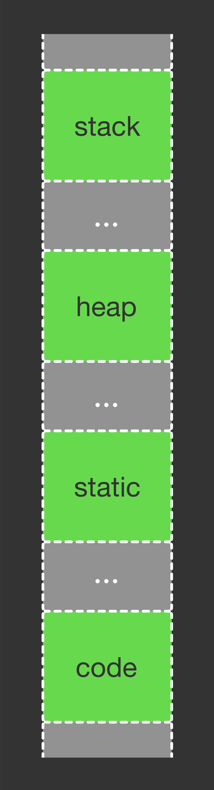

# Memory Layout

Inside of the folder `source-files-to-executables` we covered how when we compile our code the
compiler stores `code` and `data` in executable files.
- `function in source -> code section in executable`
- `global variables in source -> data section in executable file`

Now we're going to go over how a program (an executable) get's loaded into memory.


## Loading the executable
When the user executes the executable file, the OS allocates memory for the program,
and loads the `code` and `data` segments from the executable we are attempting to run into memory. 
The subsystem that handles this workflow is part of the OS and is called the `loader`.


### Loader defines certain sections of memory
In order to effectively manage memory for a running, the loader defines certain areas of memory called segments,
which have different characteristics. There are four important memory segments:  `code`,  `static`, `stack`, `heap`



- `stack segment`:   memory for local variables that are defined and used inside functions (including `main`)
- `heap segment`:    memory allocated by malloc and similar functions
- `static segment`:` memory for global variables
- `code segment`:    memory for machine code that corresponds to functions

```c
#include <stdio.h>
int w = 10;                     // allocated in static segment

int main() {
  int y;                        // allocated in stack segment
  int *z = (int *)malloc(20);   // z pointer variable will point to dynamically allocated memory in the heap, but the pointer variable itself `z` is a local variable and will be put on the stack segment
  return 0;
}
```


### Stack VS Heap Pros and Cons
Stack
- very fast
- local variables only
- limit on stack size (OS depdendent)
- variables cannot be resized
- no need to explicity de-allocate variables
- space is managed efficiently by the CPU, memory will not become fragmeneted

Heap
- slower than accessing variables on the stack
- variables accessible globally
- no limit on memory size (your hardware is your constraint)
- variables can be resized (think lists or certain data structures) using `realloc`
- you the programmer must manage memory (allocating and freeing variables you put on the heap)


Overview
- https://brilliant.org/practice/memory-segments/?chapter=memory-of-programs