## Heap

### What is the Heap?
It's a special region of your computer's memory that stores variables, similar
to a stack, but this area is not managed automatically for you.

Unlike the stack:
- the heap does not have size restrictions on variable size (apart from the obvious physical limitations of your computer).
- variables created on the heap are accessible by any function, anywhere in your program. Heap variables are essentially global in scope.

### When should you use the heap? #
- If you need to allocate a large block of memory (e.g. a large array, or a big struct), and you need to keep that variable around a long time (like a global or duration of an entire program), then you should allocate it on the heap.

- If you need variables like arrays and structs that can change size dynamically (e.g. arrays that can grow or shrink as needed) then you will likely need to allocate them on the heap, and use dynamic memory allocation functions like `malloc()`, `calloc()`, `realloc()` and `free()` to manage that memory by hand.

### Limitations
Heap memory is slightly slower to be read from and written to, because we need to use pointers to access memory on the heap. See `pointers` folder for more info.

### Modifying the Heap
To allocate memory on the heap, you must use `malloc()` or `calloc()`, which are built-in C functions.
Once you have allocated memory on the heap, you are responsible for using `free()` to deallocate that memory once you don’t need it any more. If you fail to do this, your program will have what is known as a `memory leak`.

## Visual program allocating all variables on the heap!
This is an example program of allocating all variables on the heap.
There is no real reason to do this in this particular example, since
we could have just created the variables without pointers, but this is nice
contrast to this exact program located in the folder called `stack-segment` which allocates all it's variables on the stack.

We start off by running our program, which executes `main()`, thus creates a new function context.

When we step into `main`, on line 12 we declare a pointer variable `age`, with `malloc()`. When we use `malloc()` we are putting data in the heap. At this point though, all we have done is create an `age` variable that points to a memory
address on the heap. What `(int*)malloc(sizeof(int))` is doing is:

- `sizeof(int)` will tell us how many bytes we need to store an `int` on our current computer. We will get 4 back

- So now that we have 4 essentially `malloc` is being called like this: `malloc(4)`, which will allocate 4 bytes of memory space on the heap and return a pointer to that memory address on the heap
- lastly we get to `(int*)malloc(4)`, which is essentially casting the pointer returned from `malloc()` , which is just a memory address, into an integer.

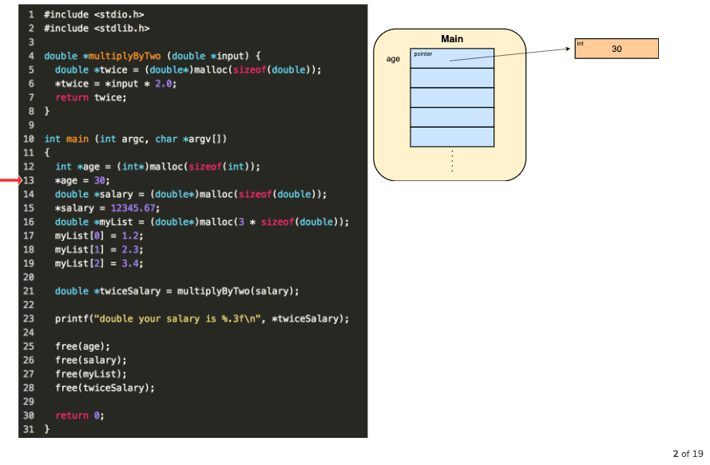
Next on line 13, we assign age the value 30.

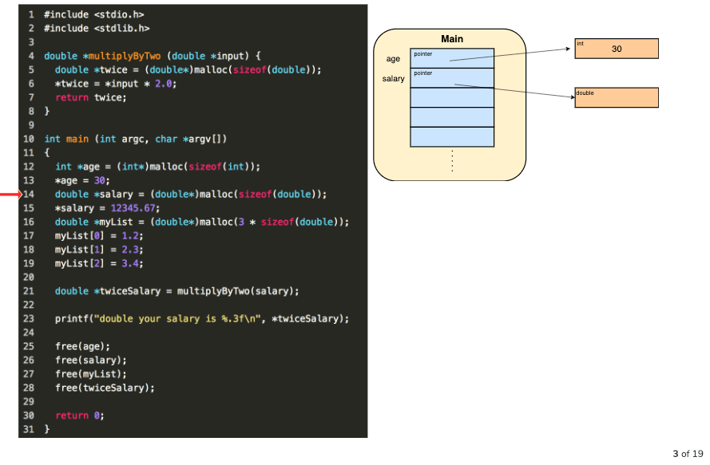

On line 14, we created a new pointer variable called `salary`. Using malloc we create a new space on the heap that's large enough to fit a `double`.

On line 15, we assign `salary an actual value.

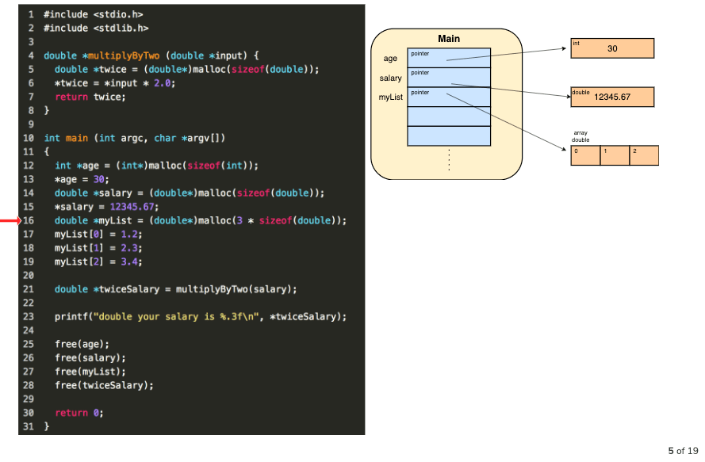

On line 16, we create a new pointer variable `myList` and create space on the heap which will fit 3 doubles.

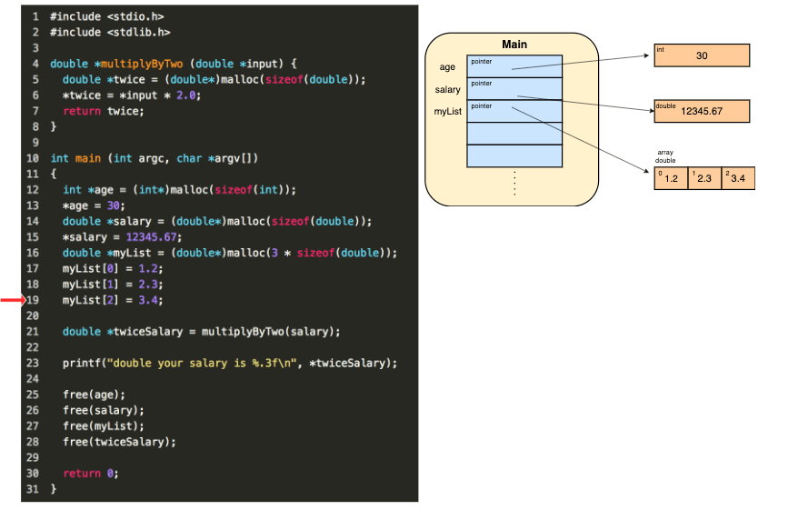

On line 17-19, we just assign values to our list, which lives in the heap.

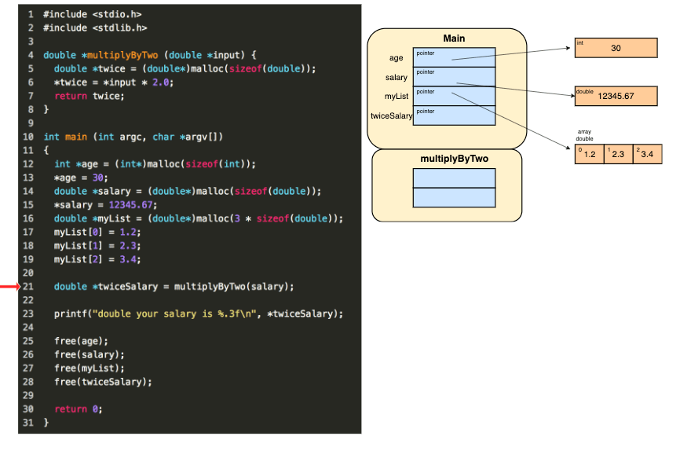

On line 21, we create a new pointer variable `twiceSalary` and call `multiplyByTwo()` and create a new scope context for `multiplyByTwo`

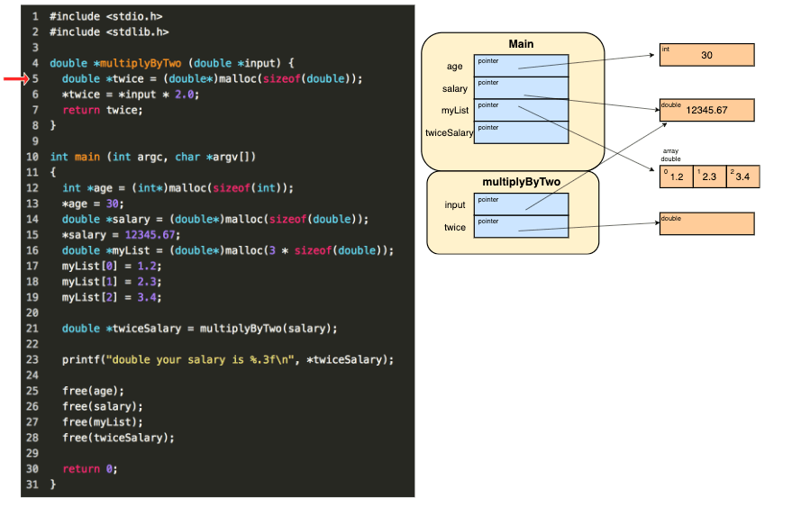

Next we create a new we create a new pointer variable `twice` which will point
to a memory adress on the heap that can fize a `double` value.

Next we evaluate the value that `*input` points to and multiply by 2 and store the value at the memory address that `*twice` points to.

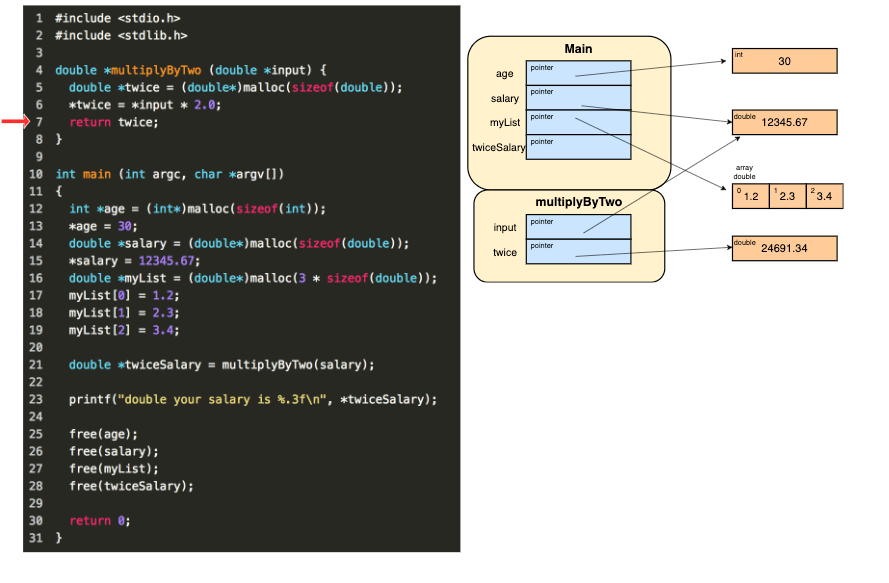

Next we hit the `return` statement inside our `multiplyByTwo` function.

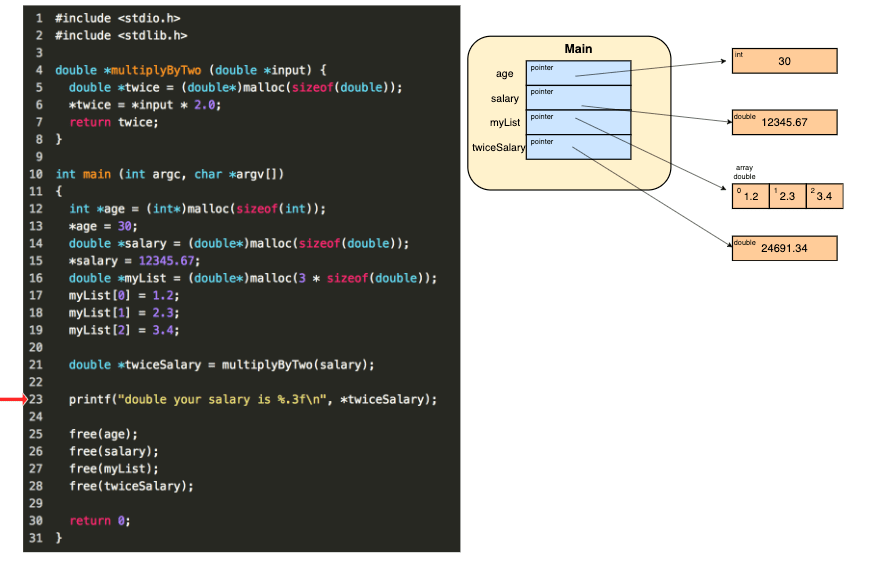

So now that `multiplyByTwo` is done running, it's execution context is removed.

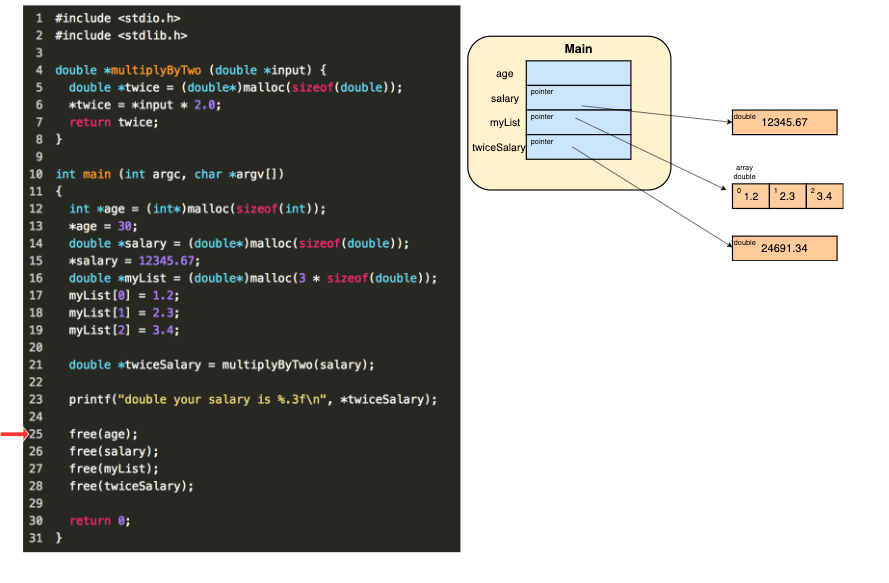

Next on line 25-28 we `free` the memory we used up in the heap.

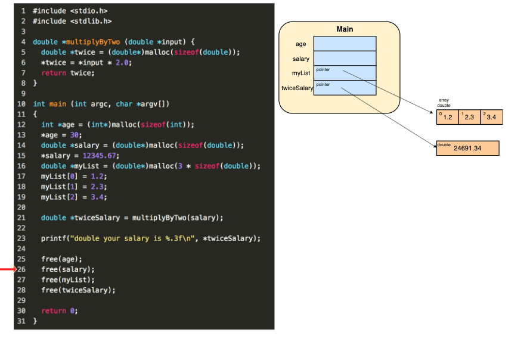

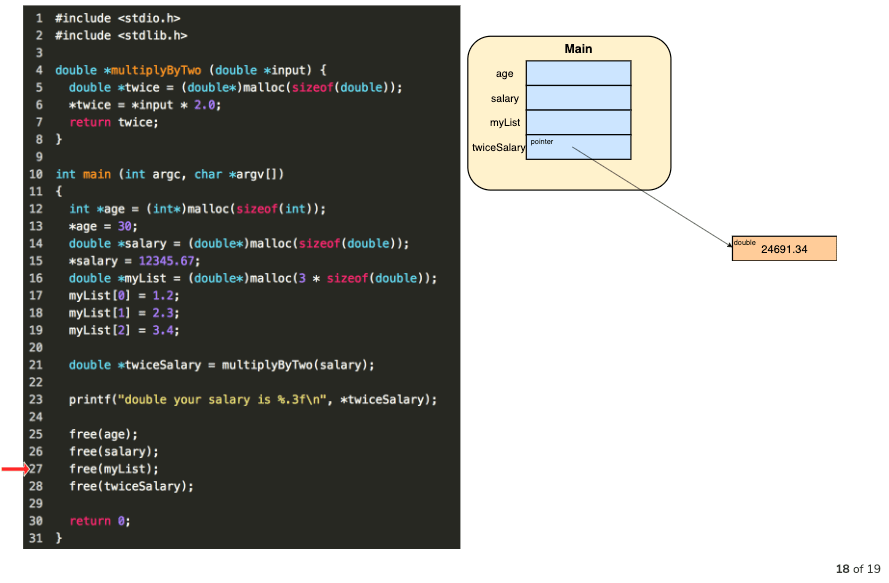

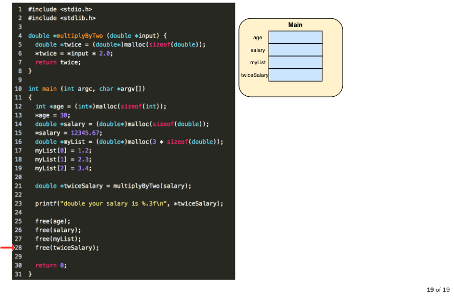

### References
- https://brilliant.org/practice/the-heap-segment/?p=7