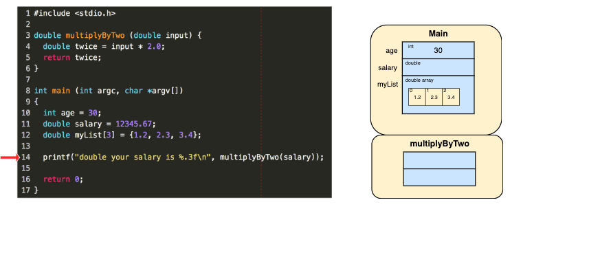
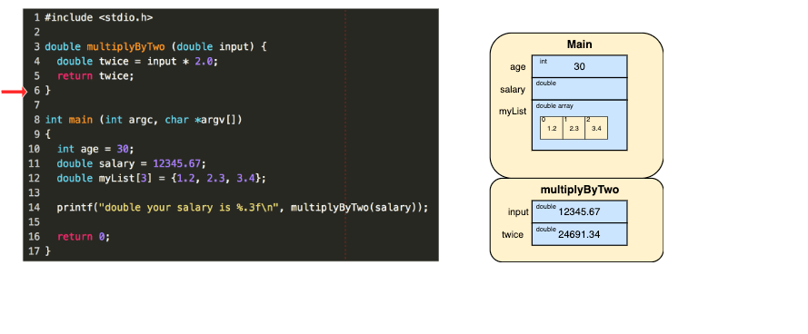
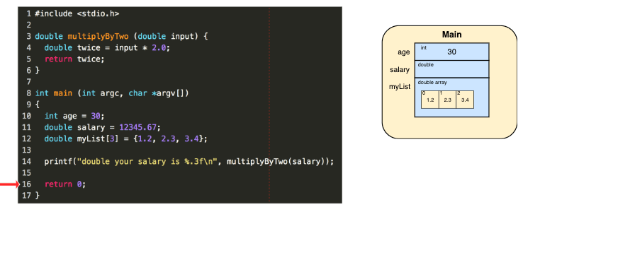

# Stack

### What is the Stack?
It’s a special region of your computer’s memory that stores temporary variables created by each function (including the main() function).


Every time a function declares a new variable, it is 'pushed' onto the stack. Then every time a function exits,
all of the variables pushed onto the stack by that function, are freed (that is to say, they are deleted).
Once a stack variable is freed, that region of memory becomes available for other stack variables.

### When should you use the stack?
- If you are dealing with relatively small variables that only need to persist as long as the function using them is alive, then you should use the stack, it’s easier and faster.


```c
#include <stdio.h>
int main() {
  int my_int = 0;
  printf("%i\n", my_int); // allocated on the stack segment of memory, since we are creating this function in a code block.
  return 0;
}
```

### Memory Management with Stack 
The advantage of using the stack to store variables, is that memory is managed for you 

```c
#include <stdio.h>
int main() {
  int my_int = 0;           // this veriable will be added to the stack segment!
  printf("%i\n", my_int); 
  return 0;
}
```


### Stack variables are local in nature 
A key to understanding the stack is the notion that when a function exits, all of its
variables are popped off of the stack (and hence lost forever). Thus stack variables
are local in nature.

This is related to a concept we saw earlier known as variable scope, or local vs global variables.
A common bug in C programming is attempting to access a variable that was created on the stack inside some function, from a place in your program outside of that function (i.e. after that function has exited).

### Limitation
Another feature of the stack to keep in mind, is that there is a limit (varies with OS)
on the size of variables that can be stored on the stack. This is not the case for variables
allocated on the heap.

To summarize the stack:
- the stack grows and shrinks as functions push and pop local variables
- there is no need to manage the memory yourself, variables are allocated and freed automatically
- the stack has size limits
- stack variables only exist while the function that created them, is running


You don’t have to allocate memory by hand, or free it once you don’t need it any more.


### Visual Program for Allocating on the Stack


On lines 10, 11 and 12 we declare variables: an int, a double, and an array of three doubles. These three variables are pushed onto the stack as soon as the main() function allocates them. 



On line 14, we call `multiplyByTwo(salary)` which creates a new function context.
Notice that since `multiplyByTwo(salary)` is a global variable like `main` it's context is created on the same global level as `main()`.

Now that we're inside the `multiplyByTwo(salary)` function we see the `input`
and `twice` variable created, so those get pushed onto the stack.



When we finally pass the `return` statement on line 5 from within `multiplyByTwo` function, the function completes, so the variables inside `multiplyByTwo` get popped off the stack and the `multiplyByTwo` function
itself gets removed.




### References
- https://brilliant.org/practice/the-stack-segment/?p=3