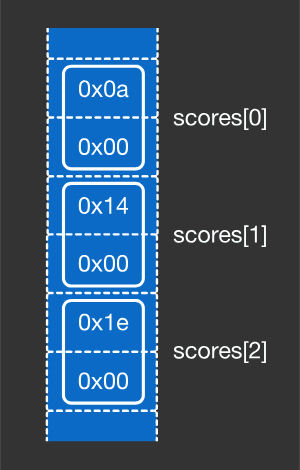

# Source Files to Executables
When we run our programs (executables) they are loaded into our computer's memory. But, more specifically
certain parts of our computer program get loaded into different sections within memory. 

But let's review first. 

### Review
Programs are written in human readable text that a programmer writes called source files. 
The compiler reads source files, compiles them, and outputs a file which is called an executable file.

The executable file contains instructions and information that are readable by the OS and the CPU.

An executable file is specific to both the OS and the CPU architecture, that is when you compile your C
program, for example on Mac, and creates the binary executable file, you can't just transfer that binary
executable file over to another computer and immediately run the program. This is because a compiler will
on a computer will generate specific machine code for the CPU it's running on.


There are two essential pieces of information that are stored in the executable file: 

### 1. Code segment (functions -> code segment in executable file)
**Code is the compiled version of functions:** each function in the source file will be translated into a chunk of machine code, and stored in the executable file. Machine code is a set of instructions that will be executed by the CPU. Each instruction is a basic operation like reading from, and writing to, memory, adding and subtracting numbers, and so forth. Although all CPUs have similar concepts, the machine code is different for each CPU architecture. For example, the x86-64 architecture has its own machine code which is different from the code of the ARM architecture. For example this C program below:

```c
int main() {
  int calc(int n) {
    int x, y, z;

    x = n * 10;
    y = x + 30;
    z = x * y;
    return z + z;
  }
  return 0;
}
```

might look like this when compiled into machine code on an `x86-64` computer architecture

```c
0x8D04BF
0x01C0
0x8D501E
0x0FAFC2
0x01C0
0xC3
```
Each line is a specific CPU instruction and the CPU will know what to do with it:


### 2. Data segment (globals -> data segment in executable file)
The other essential piece in the executable file is the "data". This is the compiled version
of global variables and constants. The information for each global variable in the source file
will be stored in the executable file, along with the initial value that was specified in the source 
file. For example, consider the following global variable:

```c
short scores[3] = {10, 20, 30};
int main() {
  return 0;
}
```




Examine this C function:

